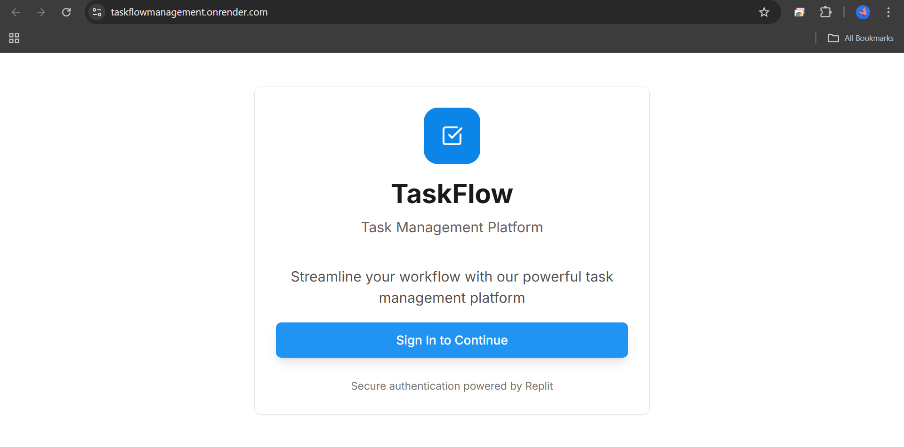
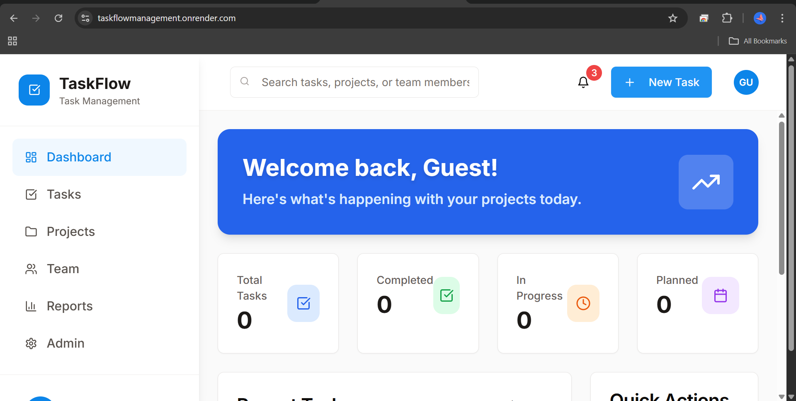
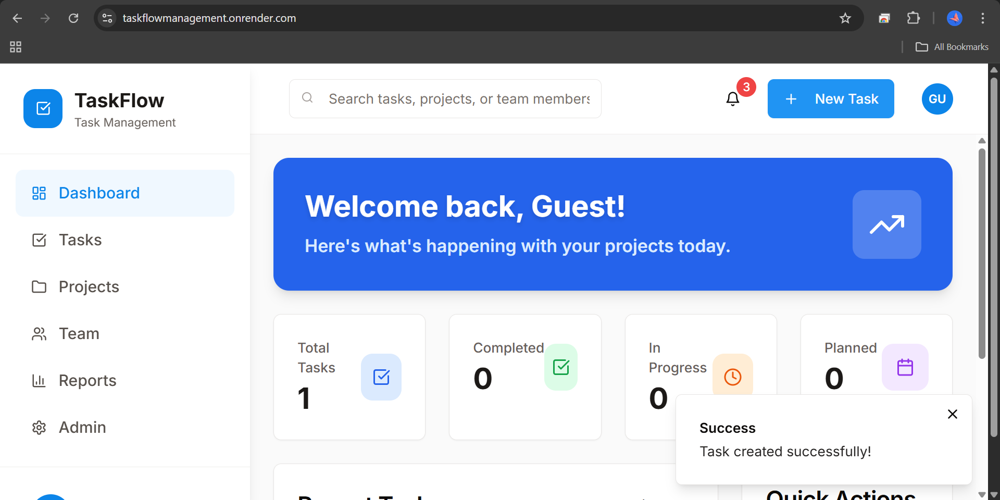

🚀 TaskFlow Management

TaskFlow Management is a robust, full-stack workflow platform designed to bridge the gap between team productivity and real-time task tracking. Built with a focus on Type Safety, Scalability, and Performance, it provides a seamless experience for managing complex project lifecycles.

Login Page: 
Main Dashboard: 
Functional Demo: 

🛠️ Tech Stack

Frontend: React.js (Vite), Tailwind CSS 
Backend: Node.js, Express.js 
Database: PostgreSQL 
Authentication: JWT (JSON Web Tokens) 
Development Tools: Git, GitHub, Postman 

🏗️ Technical Highlights

Stateful Kanban Logic: Engineered a dynamic task board with optimized React state management for fluid drag-and-drop transitions.
Secure Authentication: Implemented a stateless authentication system using JWT, ensuring secure access to user-specific dashboards and task data.
Relational Data Modeling: Architected a robust PostgreSQL schema to handle task relationships, user profiles, and status updates with high data integrity.
Responsive UI/UX: Utilized Tailwind CSS to build a mobile-first, high-performance interface that adapts to all screen sizes.
AI-Assisted Development: Leveraged Cursor AI to optimize code structure and accelerate the development of complex backend logic.

📂 Project Structure

Plaintext
├── client/          # React frontend (Vite)
│   ├── src/         # UI components and React logic
├── server/          # Node.js & Express backend
│   ├── routes.ts    # Secure RESTful API endpoints
│   ├── auth.ts      # JWT Authentication middleware
├── shared/          # Data schemas and shared types
└── README.md        # Technical Documentation

⚙️ Installation & Setup

Clone the Repository:

Bash
git clone https://github.com/Gopaswathy98/Taskflowmanagement.git
cd Taskflowmanagement
Install Dependencies:

Bash
npm install
Environment Configuration:
Create a .env file in the root and add your database credentials and JWT_SECRET.

Run Development Server:
Bash
npm run dev
Bash
npm run dev
